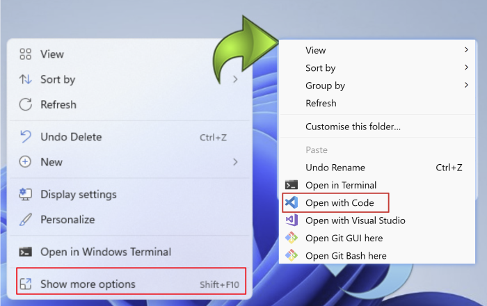
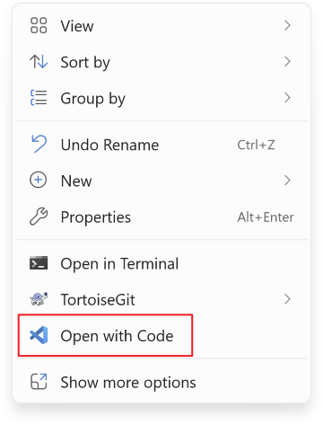

# What's this for

If you're a developer using Windows 11 with VSCode, you may notice that the "Open With Code" option is missing from the context menu after installing VSCode. To access it, you'll need to click "Show more options" and then select "Open With Code."

By running `python ./install_context_menu_for_vscode.py` with **administrative privileges**, you can achieve the following:

# How to run
- Enable Developer Mode(Settings > System > For developers > Developer Mode)
- configure the installation directory of your VS Code in the script
- Open a terminal console with **administrative privileges** and run `python ./install_context_menu_for_vscode.py`

# Acknowledgments

Thanks to [Chigusa0w0](https://github.com/Chigusa0w0) for the contribution in [this post](https://github.com/microsoft/vscode/issues/183297#issuecomment-1594350702). The Python script in this repository is based on the detailed description, implementing each step as outlined. Since the original process involves multiple steps, I automated it using Python for convenience.

